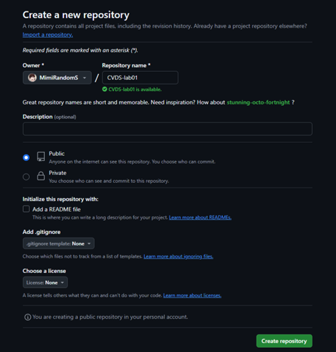

# LABORATORIO 1- INTRODUCCIÓN GIT
ESCUELA COLOMBIANA DE INGENIERÍA - CICLOS DE VIDA DE DESARROLLO DE SOFTWARE

---

## Integrantes
- Geronimo Martinez Nuñez.
- Carlos David Barrero Velasquez.

---

## Respuestas ✅
### Primera parte
Creacion del repositorio de manera local 


-	Averigua para qué sirve y como se usan estos comandos **git add** y **git commit -m “mensaje”**
Respuesta:
#### Git add
```bash
   git add .
```
Este comando se usa para añadir todos los archivos nuevos o modificados al área de preparación.

```bash
   git add NAME1, NAME2
```
También permite añadir archivos de forma manual, mencionando los nombres específicos de los archivos que queremos preparar.

#### Git Commit
```bash
   git commit -m "mensaje"
```
Este comando guarda los cambios en el repositorio, agregando un mensaje descriptivo que explique las modificaciones realizadas.

Para crear un repositorio vacío en GitHub, simplemente haz clic en el botón "Crear repositorio" y completa el formulario correspondiente, como en la imagen lo muestra.



Despues se conecta con el repositorio local al remoto que acabamos de crear.
```bash
   git add .
   git commit -m "Primer commit"
   git remote add origin https://github.com/MimiRandomS/CVDS_Lab01
   git push -u origin main
```

---

### Segunda parte

## :white_check_mark: 1.
1. Empezando la segunda parte del laboratorio escogimos que el owner es Geronimo Martinez y el collaborator es Carlos Barrero
## :white_check_mark: 2, 3 y 4.

Aqui podemos ver la serie de pasos 2, 3 y 4.


## :white_check_mark: 5, 6, 7 y 8.

Al editar el archivo **README.md** simultáneamente en la rama principal, se generó un conflicto que requiere que quien resolvió el conflicto decida entre aceptar, descartar o combinar ambos cambios realizados.


Estos son algunos cambios al azar que realizamos para ver que sucedia cuando editabamos al tiempo, como ya mencionamos las opciones para resolver el conflicto, en los commit esta separado por colores verde y rojo el cual informan los cambios realizados.

polin
gero
hola

### Ejemplo de como se ve el commit al aceptar los cambios, en este caso acepta los dos cambios y los combina.


## PARTE III (Trabajo de a parejas)

1.	¿Hay una mejor forma de trabajar con git para no tener conflictos?

# Trabajar en ramas (branching)

El uso de ramas en Git es una de las mejores prácticas para mantener tu flujo de trabajo organizado y minimizar conflictos. En lugar de trabajar directamente en la rama principal (main o master), puedes crear una rama independiente para cada nueva característica, corrección de errores o experimento. Esto te permite desarrollar sin afectar el código estable. Por ejemplo, si estás agregando una nueva funcionalidad, podrías crear una rama llamada feature/nueva-funcionalidad con el comando git checkout -b feature/nueva-funcionalidad. Una vez que termines, puedes fusionar los cambios con la rama principal usando un merge o pull request, asegurándote de revisar los cambios y probarlos antes de combinarlos. Esto no solo organiza el trabajo, sino que también facilita la colaboración en equipo y reduce el riesgo de errores en el código compartido.
dame esto en formato markdown

2.	¿Qué es y como funciona el **Pull Request**?

## **¿Qué es un Pull Request (PR)?**
Un **Pull Request (PR)** es una función en plataformas de control de versiones como **GitHub**, **GitLab** o **Bitbucket** que permite:

- Notificar a los colaboradores de un proyecto que has realizado cambios en una rama de código y deseas que esos cambios sean revisados.
- Facilitar la colaboración y la revisión de código antes de que los cambios se integren en la rama principal (**main** o **master**).

# ¿Cómo funciona un Pull Request?

## **1. Crear una rama nueva para cambios.**
El primer paso es crear una rama donde trabajarás en la nueva funcionalidad o corrección. Esto separa tu trabajo del resto del proyecto principal.

```bash
git checkout -b nueva-funcionalidad
```
## **2. Haz commits y sube la rama al repositorio remoto.**
```bash
git add archivo.txt
git commit -m "Agregar nueva funcionalidad"
git push origin nueva-funcionalidad
```
## **3. Abre un Pull Request en GitHub.**
## **4. Colabora con tus compañeros para revisar y mejorar el código.**
## **5. Fusiona el Pull Request cuando esté listo.**
1. Haz clic en el botón "Merge Pull Request".
2. Elige la opción de fusión que prefieras:
* **Merge commit:** Mantiene todos los commits realizados.
* **Squash and merge:** Combina todos los commits en uno solo.
* **Rebase and merge:** Aplica los commits en la rama principal sin un commit de fusión.
3. Confirma la fusión.
## **6. (Opcional) Elimina la rama.**
```bash
git branch -d nueva-funcionalidad
```

3. Creen una rama cada uno y suban sus cambios


Editando linea desde rama gero